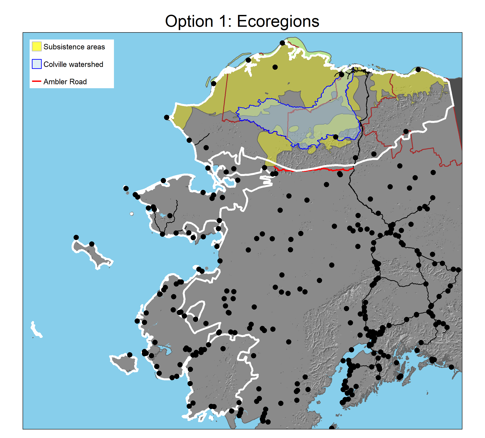
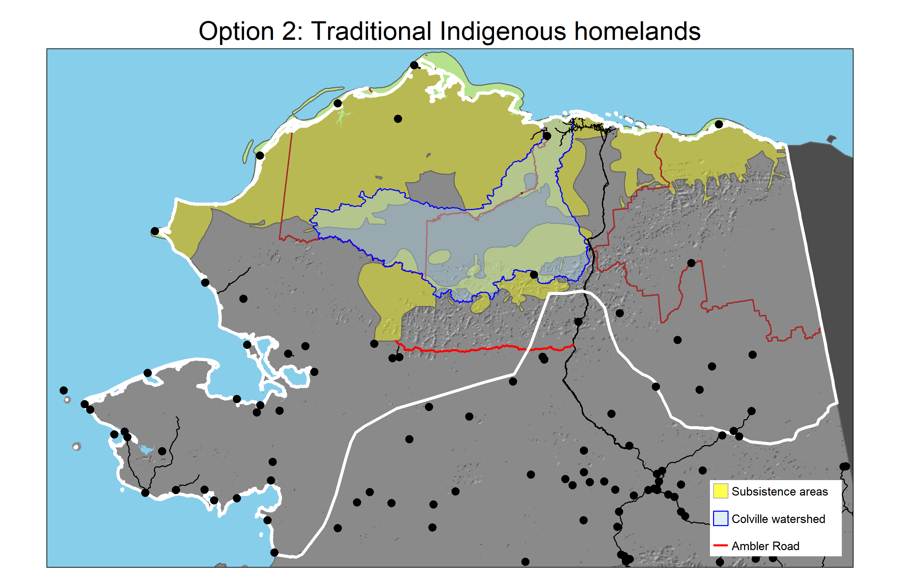
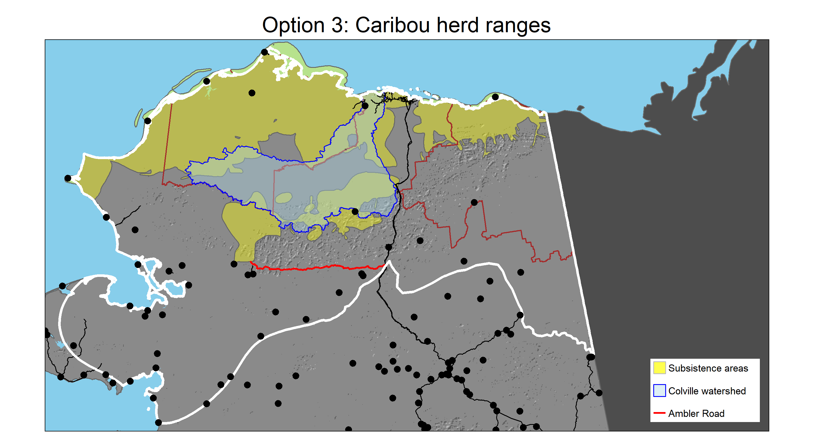

<!-- The head tag, <head>, is a container for metadata in an html document. 
We can use it to define styles and do lots of other cool things things. -->
<head>

```{css, echo = FALSE}
/* We can use the body tag to change the default text size of the whole document. */
  
body {
  font-size: 18px
}

/* We can increase the space between our list items */
  
ul, li {
  padding-top: 0.5em;
}

/* Try a different quote style, since the above did not work.*/
.timquote {
  display: inline-block;
  width:500px;
  height:200px;
  background-color: #7FADE3;
  margin-top: 10px;
  marin-left: 10px;
}
```

<!-- Set up knitr, load the R libraries, and load and prep the data we'll use below.-->

```{r code_setup, include = FALSE}
options(knitr.table.format = "html")

knitr::opts_chunk$set(error = TRUE)

library(units)
library(sf)
library(tmap)
library(tidyverse)
library(shiny)

## Write a function for calculating area in acres below
area_acres <- function(x){
    st_area(x) %>% 
    ## Convert to acres
    set_units('acres') %>% 
    ## Get rid of the label
    as.numeric()
}

## Load in the shapefiles. Most require similar steps so I'll prep a tibble
## containing their information and map across that to load them at once.
## Projection was handled in the GIS data prep part of
## Arctic_Landscape_Options_11.R.

## Set up the info to be loaded
tibble(
  base_path =
    'files/arctic/',
  file =
    c(
      ## AK state boundary 
      'ak_boundary',
      ## NPR-A boundary
      'npra',
      ## Arctic Refuge boundary
      'arctic_refuge',
      ## Caribou annual ranges
      'wah',
      'tch',
      'cah',
      'pch',
      ## Inupiat and Gwich'in homelands
      'inupiat',
      'gwichin',
      ## Subsistence areas
      'north_slope_subsistence',
      ## Arctic Level 3 ecoregions
      'arctic_ecoregion',
      ## Colville River watershed
      'colville_watershed',
      ## Arctic Circle
      'arctic_circle',
      ## Ambler road
      'ambler',
      ## All AK Level 3 ecoregions
      'ak_L3_ecoregions',
      ## Alaskan cities
      'ak_cities'),
  name = 
    c('ak',
      'npra',
      'refuge',
      'wah',
      'tch',
      'cah',
      'pch',
      'inupiat',
      'gwichin',
      'subsistence',
      'arctic_ecoregion',
      'colville',
      'arctic_circle',
      'ambler',
      'ecoregion',
      'ak_cities')
) %>% 
  ## Map across the tibble to load and prep the shapefiles, assigning them with
  ## their identified names to the global environment. I'll actually use pwalk()
  ## instead of pmap() since this triggers effects but returns invisibly. I just
  ## want the shapefiles loaded and prepped, I don't care about something
  ## getting returned.
  pwalk(
    function(base_path, file, name, ...){
      ## Identify the full path of the shapefile
      paste0(base_path, file, '.shp') %>% 
        ## Load the shapefile
        st_read() %>% 
        ## Assign it to the global environment with the desired name
        assign(x = name, value = ., envir = .GlobalEnv)
    })

## Create a combined caribou range polygon
caribou <- 
  list(wah, tch, cah, pch) %>% 
  ## Use reduce() to apply this to each pair until all are combined
  reduce(st_union) %>% 
  ## Clip the result to AK to exclude Canadian areas
  st_intersection(ak) %>% 
  ## Dissolve this into one feature
  st_union()

## Create a combined Alaska Native traditional lands polygon
AKnative <- 
  ## Combine the polygons
  st_union(inupiat, gwichin) %>% 
  ## Clip the result to AK to exclude Canadian areas
  st_intersection(ak) %>% 
  ## Dissolve this into one feature
  st_union()

## Create a vector of communities in the WAH range represented on the WACH WG
wg_communities <-
  c("Allakaket", "Ambler", "Anaktuvuk Pass", "Atqasuk",
    "Utqiaġvik", "Bettles", "Brevig Mission", "Buckland", "Deering", "Elim",
    "Galena", "Golovin", "Hughes", "Huslia", "Kaltag", "Kiana", "Kivalina",
    "Kobuk", "Kotlik", "Kotzebue", "Koyuk", "Koyukuk", "Noatak", "Nome",
    "Noorvik", "Nuiqsut", "Nulato", "Point Hope", "Point Lay", "Saint Michael",
    "Selawik", "Shaktoolik", "Shishmaref", "Shungnak", "Stebbins", "Teller",
    "Unalakleet", "Wainwright", "Wales", "White Mountain", "Wiseman")

## Create a vector of key partner communities
partners <- c('Nuiqsut', 'Utqiaġvik', 'Kaktovik', 'Arctic Village', 'Venetie')
```


## Landscape conservation at TWS

In 2020, The Wilderness Society started shifting the way we work toward a vision of a nationwide network of resilient landscapes as the means of achieving our new strategic framework and collective impact results.

The goal of this shift in approach is to sustain human flourishing, biological diversity, and natural ecological processes over long periods of time.

To do this, we are changing our:

* *Geographic focus* from **individual** parcels to **whole landscapes**
* *Perspective* from federal public lands to integrated multi-owner ecosystems
* *Approach* from enlisting support for an already established agenda to shared decision-making and collaboration with communities

As John Jarvis, former director of the National Park Service, <a href = "https://escholarship.org/uc/item/2mq6v6tn" target = "_blank">described it</a>:

<div class = "timquote">
*Climate change, along with other stressors, has forced a reconsideration of the current model of protected area management to one of large landscape integration. Learning to manage at the landscape scale, with parks or equivalent protected areas linked with corridors and integrated with communities, transportation systems, local people, watersheds, agriculture, and sustainable economies, is a critical component to the future of conservation.*
</div>

<br>

For more information about TWS' approach to landscape conservation, see the resources in <a href = "https://www.dropbox.com/sh/mzryjaw8rjyligz/AAAo61G-YgH-fjz1gRU8qkRYa?dl=0" target = "_blank">this Dropbox folder</a>.

<hr>
<br>

## Defining the Arctic landscape
As TWS makes the shift to landscape conservation, it is important to be clear about which areas are covered by each priority landscape. While some actions may take place outside of the official landscape boundaries, we expect most efforts will be contained by the landscape extent. It is thus important to be clear how we are defining each landscape.

While the Arctic landscape was identified as one of the TWS priority landscapes, it was not part of the same process of selection by Landscape Review Teams that other landscapes underwent. As a result, no formal definition of the landscape boundary was ever established.

This document presents a starting point to stimulate thinking about how the Arctic landscape could be defined. It describes multiple options and provides interactive data to help the Arctic team explore differences between possible boundaries. **These options are not meant to be an exhaustive set of possibilities**, but rather to present a possible set of options that can further the Arctic team's thinking around selecting a boundary for the Arctic Landscape. In the words of TWS Senior Science Director Greg Aplet, whatever boundary we choose, *“the most important thing is that the boundary reflects an ecosystem of sufficient size to sustain its contents.”*

Three potential options are described:

1. Arctic ecoregions
2. Traditional Indigenous homelands
3. Caribou ranges

We first provide an overview of each option, before offering interactive tools for exploring tradeoffs.

<hr>

## Option 1: Ecoregions

As a starting point for identifying the priority landscapes for the Lower 48, the TWS landscape team used ecoregions. These are areas that typically have similar environmental conditions, in terms of climate, soils, ecosystems, species, etc.

As the map below demonstrates, Alaska contains 20 "level 3" ecoregions. Data from the US <a href = "https://edg.epa.gov/metadata/catalog/search/resource/details.page?uuid=%7Bd60d4f92-706f-4f6a-9e38-6fb063bd2962%7D" target = "_blank">Environmental Protection Agency</a>.


<br>

Selecting 6 arctic ecoregions with similar features yields a boundary covering `r arctic_ecoregion %>% area_acres() %>% format(big.mark = ',')` acres.

It should be noted, that while ecoregions formed the starting point for priority landscape identification in the Lower 48, other considerations went into selection of the final priority landscape boundaries. As the map below displays, use of arctic ecoregions would encapsulate all of the NPR-A, but only the northern portions of the Arctic Refuge. It encapsulates all of the Colville watershed and the vast majority of subsistence harvest areas used by many North Slope communities.^[Subsistence harvest areas depicted in the figure represent combined areas for harvest of caribou, moose, furbearers, fish, wildfowl, and vegetation for Point Hope, Point Lay, Wainwright, Utqiaġvik, Atqasuk, Nuiqsut, Anaktuvuk Pass, and Kaktovik. Data from the <a href = "https://accscatalog.uaa.alaska.edu/dataset/north-slope-rapid-ecoregional-assessment" target = "_blank">BLM North Slope REA</a>.] The arctic ecoregions include many, but not all partner communities. Efforts relating to the Ambler Road and to caribou migration and wintering range would fall largely outside of this boundary.



<br>

<hr>

## Option 2: Traditional Indigenous homelands

Indigenous people have long stewarded the lands, waters, and species of what is now called Alaska. These peoples maintain rich cultural and spiritual connections to the land and its inhabitants. In recognition of this stewardship and connections, as well as the importance of human flourishing to effective landscape conservation, one possibility for defining the landscape boundary is to use the boundary of traditional Indigenous homelands.

The map below displays traditional homelands of the Iñupiat and Gwich'in people, based on data from <a href = "https://native-land.ca/" target = "_blank">Native Land Digital</a>.


<br>

Combining both homelands yields a boundary covering `r AKnative %>% area_acres() %>% format(big.mark = ',')` acres.

Use of this boundary for the Arctic landscape would capture all of TWS' work in the NPR-A and Arctic Refuge and would include main partner communities. Efforts relating to the Ambler Road would fall partially outside of this boundary.



<br>

<hr>

## Option 3: Caribou herd ranges

Four caribou herds calve in northern Alaska: the Western Arctic Herd (WAH), Teshekpuk Caribou Herd (TCH), Central Arctic Herd (CAH), and Porcupine Caribou Herd (PCH). These caribou are central to culture, food security and the well-being of Indigenous people across northern Alaska. They also play a variety of important ecological roles.


<br>

Defining the Arctic Landscape boundary based on caribou herd ranges would represent a functionally based landscape definition. This is not intended to indicate that caribou are the only important species in the region. Rather, caribou are a convenient option for a land-based species that covers broad areas and thus encompasses many other important species and habitats in a way unparalleled by most other Arctic species.

As the table below shows, these herds cover large areas. This brings them into contact with many communities and protected areas.

```{r caribou_range_table, echo = FALSE}
list('WAH' = wah,
     'TCH' = tch,
     'CAH' = cah,
     'PCH' = pch,
     'Total' = caribou) %>% 
  imap(
    function(.x, .y){
    ## Calculate area in units of sq meters
    area_ac <-
      area_acres(.x)
    
    ## Create a tibble
    tibble(
      'Herd' = .y,
      'Area_acres' = area_ac)
  }) %>% 
  bind_rows() %>% 
  ## Display the results as a kable
  knitr::kable(
    format = 'html',
    digits = 0,
    col.names = c('Herd',
                  'Area (acres)'),
    align = c('l', 'r'),
    format.args = list(big.mark = ',')) %>% 
  kableExtra::kable_styling(
    bootstrap_options = 'striped',
    full_width = FALSE)
```

<br>

Using the combined caribou range area to define the Arctic landscape would help ensure that we are working in a functionally intact landscape that is large enough to sustain its contents. It would also cover many of the TWS priority areas and encapsulate most of our partner communities. Furthermore, this scale coincides with the scale of subsistence harvest areas used by many North Slope communities.



<br>

<hr>

## Summary

### Summary table

The table below summarizes data for each of the three options.

```{r summary_table, echo = FALSE, message = FALSE, warning = FALSE}
opts <- c('Ecoregions', 'Indigenous homelands', 'Caribou ranges')

## Calculate summary information
summary_data <-
  list(
    arctic_ecoregion,
    AKnative,
    caribou) %>% 
  imap(
    function(.x, .y){
      ## Identify the cities that intersect with the study area polygon
      int_tmp <- st_intersection(ak_cities, .x)
      
      ## Calculate and compile the desired outputs
      list(
        ## Option name
        'name' = opts[.y],
        ## Option area (ha)
        'area' =
          area_acres(.x),
        ## Vector of communities included in the option
        'communities' =
          int_tmp %>% 
          pull(name),
        ## Vector of WACH WG communities included
        'wg_communities' =
          int_tmp %>% 
          filter(name %in% wg_communities) %>% 
          pull(name),
        ## Vector of key partners included
        'partners' =
          int_tmp %>% 
          filter(name %in% partners) %>% 
          pull(name),
        ## Percent Ambler Road length included
        'ambler_per' =
          as.numeric(st_length(st_intersection(ambler, .x)) / st_length(ambler)),
        'colville_per' = 
          as.numeric(sum(st_area(st_intersection(colville, .x))) / st_area(colville))
      )
    }
  )
names(summary_data) <- opts

## Display the results as a kable
summary_data %>% 
  map_dfr(
    function(x){
      tibble(
        option = x$name,
        area = x$area,
        communities_included = length(x$communities),
        wg_included = length(x$wg_communities),
        partners_included = length(x$partners),
        ambler_included = round(x$ambler_per * 100, 2),
        colville_included = round(x$colville_per * 100, 2)
      )
    }
  ) %>% 
  knitr::kable(
    format = 'html',
    digits = 0,
    col.names = c('Option',
                  'Total area (acres)',
                  'Communities included',
                  'WACH WG communities included',
                  'Key partners included',
                  'Ambler road percent included',
                  'Colville watershed percent included'),
    align = c('l', 'r', 'c', 'c', 'c', 'c', 'c'),
    format.args = list(big.mark = ',')) %>% 
  kableExtra::kable_styling(
    bootstrap_options = 'striped')
```

The number of communities included in each option is a slight underestimate, as differences between datasets lead some communities (e.g., Point Hope) to lie slightly outside of boundaries and thus to not be counted. Nonetheless, biases are the same across each option and thus the numbers above still reflect relative patterns.

There are 41 communities in northwest Alaska represented on the Western Arctic Caribou Herd Working Group (WACH WG). The number above reflects how many of these 41 are included in each option.

"Key" partner communities were subjectively identified as those groups with which TWS has worked most in the past and include:

* Arctic Village
* Kaktovik
* Nuiqsut
* Utqiaġvik
* Venetie

<br>

As with the WACH WG list, the number above indicates how many of those key partners are included in each option.

The Ambler Road and Colville River watershed columns indicate the percentage of the length or area, respectively, falling within the option boundary.

<br>

### Interactive map

To enable better exploration of the boundary options, check out the interactive map below by clicking, panning, and zooming.

The three options described above are depicted in the map as follows:

* <span style="color: blue;">Option 1 - </span> Arctic ecoregion
* <span style="color: purple;">Option 2 - </span> Indigenous homelands
* <span style="color: red;">Option 3 - </span> Caribou range

<br>

Each of these can be turned off or on using the buttons in the menu at top left. Click the button with the three stacked grey squares to reveal this menu.

Other data also can be turned on and off to aid in data exploration. Alaskan communities (turned off by default) are initially displayed as large circles with the color and number indicating the aggregated number of communities in a given area. Zooming in to finer scales will distribute the community locations until city- or village-specific points become visible.

The menu can also be used to select between three different basemaps:

* `Esri.WorldTopo` offers terrain features as well as various human features.
* `Esri.WorldImagery` displays a digital photo, for a snapshot of ground conditions.
* `OpenStreetMap` provides road and human feature information, as well as selected natural features.

<br>

```{r interactive_map, echo = FALSE, message = FALSE, warning = FALSE}
## Initate an interactive tmap
tmap_mode('view')
tmap_options(check.and.fix = TRUE)
  
tm_tmp <-
  ## Add desired basemaps
  tm_basemap(
    c('Esri.WorldTopoMap',
      'Esri.WorldImagery',
      'OpenStreetMap')) +
    
    ## Add each boundary option
    tm_shape(
      arctic_ecoregion %>% 
        st_union(),
      name = 'Option 1 - Arctic ecoregion') +
    tm_borders(
      col = 'blue',
      lwd = 3) +
    
    tm_shape(
      AKnative,
      name = 'Option 2 - Indigenous homelands') +
    tm_borders(
      col = 'purple',
      lwd = 3) +
    
    tm_shape(
      caribou,
      name = 'Option 3 - Caribou range') +
    tm_borders(
      col = 'red',
      lwd = 3) +
    
    ## Add additional features
    tm_shape(ecoregion,
             name = 'Ecoregions') +
    tm_polygons(
      col = 'US_L3NAME',
      alpha = 0.4) +
  
    tm_shape(subsistence,
             name = 'Subsistence use areas') +
    tm_polygons(
      col = 'yellow',
      alpha = 0.4) +
    
    tm_shape(npra,
             name = 'NPR-A') +
    tm_borders(lwd = 1.5,
               col = 'brown',
               alpha = 0.5) +
    
    tm_shape(refuge,
             name = 'Arctic Refuge') +
    tm_borders(lwd = 1.5,
               col = 'brown',
               alpha = 0.5) +
    
    tm_shape(arctic_circle,
             name = 'Arctic Circle') +
    tm_lines() +
  
    tm_shape(colville,
             name = 'Colville River watershed') +
    tm_polygons(
      col = 'lightblue',
      border.col = 'blue',
      alpha = 0.4) +
    
    tm_shape(ambler,
             name = 'Ambler Road') +
    tm_lines(
      col = 'brown',
      lwd = 2,
      alpha = 0.6) +
  
  ## Add cities
  tm_shape(ak_cities,
           name = "Communities") +
  tm_dots(size = 0.1,
          alpha = 0.5,
          clustering = TRUE)

## Make this a leaflet widget and use leaflet to hide some info by default
tm_tmp %>%
  tmap_leaflet() %>% 
  leaflet::hideGroup(c('Ecoregions',
                       'Subsistence use areas',
                       'Colville River watershed',
                       'Communities'))

```

<br>


### Interactive tool

Use the drop-down menu in the tool below to select between the various options. This will cause the information in the table to change to reflect the values for that specific option. Lists of communities and partners included under the selected option are listed in the interactive table below. Note that these lists provide a slight underestimate, as differences between spatial datasets lead some communities (e.g., Point Hope) to lie slightly outside of boundaries and thus to not be counted. Such biases are consistent across options.

```{r shiny, echo = FALSE}
## Create a shiny app that provides tabular statistics for each option with
## a dropdown menu

#### Shiny app
shinyApp(
  
  ## Set up the UI
  ui = fluidPage(
    
    ## Add a title panel:
    titlePanel("Arctic Landscape Boundary Options"),
    
    ## Insert a line break
    tags$br(),
    
    ## Set formatting to consist of two columns
    sidebarLayout(
      
      ## Create a sidebar panel where users will select the species of interest
      sidebarPanel(
        
        selectInput(
          inputId = 'option',
          label = 'Option',
          choices = opts),
      ),
      
      ## Set up the main panel to display results, divided into tabs
      mainPanel(
        tabsetPanel(
          
          ## Data table of all communities included
          tabPanel(
            'All',
            tableOutput('opt_all')
          ),
          
          ## Line plot of collisions over time
          tabPanel(
            'WACH Working Group',
            tableOutput('opt_wg')
          ),
          
          ## County-based collision maps
          tabPanel(
            'Key Partners',
            tableOutput('opt_key')
          )
        )
      )
    )
  ),
  
  ## Set up the server
  server = function(input, output){
    
    ## Create reactive objects
    
    ## Extract the list of included communities
    opt_all <-
      reactive({
        pluck(summary_data, input$option, 'communities') %>% 
          sort()
      })
    
    ## Extract the list of included communities
    opt_wg <-
      reactive({
        pluck(summary_data, input$option, 'wg_communities') %>% 
          sort()
      })
    
    ## Extract the list of included communities
    opt_key <-
      reactive({
        pluck(summary_data, input$option, 'partners') %>% 
          sort()
      })
    
    
    ## Create data visualizations to display the reactive summary tables for
    ## the option of interest
    output$opt_all <-
      renderTable({
        opt_all()
      })
    
    output$opt_wg <-
      renderTable({
        opt_wg()
      })
    
    output$opt_key <-
      renderTable({
        opt_key()
      })
  }#,
  
  ## Define a height parameter to determine how much vertical space the app
  ## should take up
  #options = list(height = 500)
)

```

<hr>

<br>

Thank you for your consideration of several possible Arctic Landscape boundaries. As was stated above, these are not intended to be the only options but rather as starting points for discussion. If you have further questions or are interested in other data to help inform your decisions, please do not hesitate to reach out to Tim Fullman and Jason Leppi.

