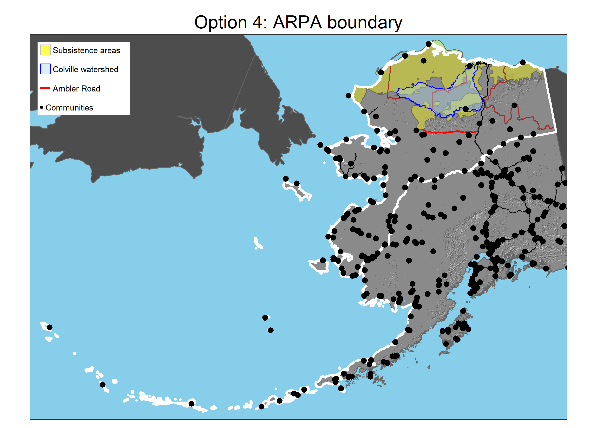

<!-- The head tag, <head>, is a container for metadata in an html document. 
We can use it to define styles and do lots of other cool things things. -->
<head>

```{css, echo = FALSE}
/* We can use the body tag to change the default text size of the whole document. */
  
body {
  font-size: 18px
}

/* We can increase the space between our list items */
  
ul, li {
  padding-top: 0.5em;
}

/* Try a different quote style, since the above did not work.*/
.timquote {
  display: inline-block;
  width:500px;
  height:200px;
  background-color: #7FADE3;
  margin-top: 10px;
  marin-left: 10px;
}
```

<!-- Set up knitr, load the R libraries, and load and prep the data we'll use below.-->

```{r code_setup, include = FALSE}
options(knitr.table.format = "html")

knitr::opts_chunk$set(error = TRUE)

library(units)
library(sf)
library(tmap)
library(tidyverse)

## Write a function for calculating area in acres below
area_acres <- function(x){
    st_area(x) %>% 
    ## Convert to acres
    set_units('acres') %>% 
    ## Get rid of the label
    as.numeric()
}

## Load in the shapefiles. Most require similar steps so I'll prep a tibble
## containing their information and map across that to load them at once.
## Projection was handled in the GIS data prep part of
## Arctic_Landscape_Options_11.R and later versions.

## Set up the info to be loaded
tibble(
  base_path =
    'files/arctic/',
  file =
    c(
      ## AK state boundary 
      'ak_boundary',
      ## NPR-A boundary
      'npra',
      ## Arctic Refuge boundary
      'arctic_refuge',
      ## Caribou annual ranges
      'wah',
      'tch',
      'cah',
      'pch',
      ## Inupiat and Gwich'in homelands
      'inupiat',
      'gwichin',
      ## Subsistence areas
      'north_slope_subsistence',
      ## Arctic Level 3 ecoregions
      'arctic_ecoregion',
      ## Colville River watershed
      'colville_watershed',
      ## Arctic Circle
      'arctic_circle',
      ## Ambler road
      'ambler',
      ## All AK Level 3 ecoregions
      'ak_L3_ecoregions',
      ## Alaskan cities
      'ak_cities',
      ## Alaska terrestrial ARPA boundary
      'arpa_ak_boundary',
      ## Recommended landscape boundary
      'recommended_boundary'),
  name = 
    c('ak',
      'npra',
      'refuge',
      'wah',
      'tch',
      'cah',
      'pch',
      'inupiat',
      'gwichin',
      'subsistence',
      'arctic_ecoregion',
      'colville',
      'arctic_circle',
      'ambler',
      'ecoregion',
      'ak_cities',
      'arpa_ak',
      'recommended')
) %>% 
  ## Map across the tibble to load and prep the shapefiles, assigning them with
  ## their identified names to the global environment. I'll actually use pwalk()
  ## instead of pmap() since this triggers effects but returns invisibly. I just
  ## want the shapefiles loaded and prepped, I don't care about something
  ## getting returned.
  pwalk(
    function(base_path, file, name, ...){
      ## Identify the full path of the shapefile
      paste0(base_path, file, '.shp') %>% 
        ## Load the shapefile
        st_read() %>% 
        ## Assign it to the global environment with the desired name
        assign(x = name, value = ., envir = .GlobalEnv)
    })

## Create a combined caribou range polygon
caribou <- 
  list(wah, tch, cah, pch) %>% 
  ## Use reduce() to apply this to each pair until all are combined
  reduce(st_union) %>% 
  ## Clip the result to AK to exclude Canadian areas
  st_intersection(ak) %>% 
  ## Dissolve this into one feature
  st_union()

## Create a combined Alaska Native traditional lands polygon
AKnative <- 
  ## Combine the polygons
  st_union(inupiat, gwichin) %>% 
  ## Clip the result to AK to exclude Canadian areas
  st_intersection(ak) %>% 
  ## Dissolve this into one feature
  st_union()

## Create a vector of communities in the WAH range represented on the WACH WG
wg_communities <-
  c("Allakaket", "Ambler", "Anaktuvuk Pass", "Atqasuk",
    "Utqiaġvik", "Bettles", "Brevig Mission", "Buckland", "Deering", "Elim",
    "Galena", "Golovin", "Hughes", "Huslia", "Kaltag", "Kiana", "Kivalina",
    "Kobuk", "Kotlik", "Kotzebue", "Koyuk", "Koyukuk", "Noatak", "Nome",
    "Noorvik", "Nuiqsut", "Nulato", "Point Hope", "Point Lay", "Saint Michael",
    "Selawik", "Shaktoolik", "Shishmaref", "Shungnak", "Stebbins", "Teller",
    "Unalakleet", "Wainwright", "Wales", "White Mountain", "Wiseman")

## Create a vector of key partner communities
partners <- c('Nuiqsut', 'Utqiaġvik', 'Kaktovik', 'Arctic Village', 'Venetie')
```


## Landscape conservation at TWS

In 2020, The Wilderness Society started shifting the way we work toward a vision of a nationwide network of resilient landscapes as the means of achieving our new strategic framework and collective impact results.

The goal of this shift in approach is to sustain human flourishing, biological diversity, and natural ecological processes over long periods of time.

To do this, we are changing our:

* *Geographic focus* from **individual** parcels to **whole landscapes**
* *Perspective* from federal public lands to integrated multi-owner ecosystems
* *Approach* from enlisting support for an already established agenda to shared decision-making and collaboration with communities

As John Jarvis, former director of the National Park Service, <a href = "https://escholarship.org/uc/item/2mq6v6tn" target = "_blank">described it</a>:

<div class = "timquote">
*Climate change, along with other stressors, has forced a reconsideration of the current model of protected area management to one of large landscape integration. Learning to manage at the landscape scale, with parks or equivalent protected areas linked with corridors and integrated with communities, transportation systems, local people, watersheds, agriculture, and sustainable economies, is a critical component to the future of conservation.*
</div>

<br>

For more information about TWS' approach to landscape conservation, see the resources in <a href = "https://www.dropbox.com/sh/mzryjaw8rjyligz/AAAo61G-YgH-fjz1gRU8qkRYa?dl=0" target = "_blank">this Dropbox folder</a>.

<hr>
<br>

## Defining the Arctic landscape
As TWS makes the shift to landscape conservation, it is important to be clear about which areas are covered by each priority landscape. While some actions may take place outside of the official landscape boundaries, we expect most efforts will be contained by the landscape extent. It is thus important to be clear how we are defining each landscape.

While the Arctic landscape was identified as one of the TWS priority landscapes, it was not part of the same process of selection by Landscape Review Teams that other landscapes underwent. As a result, no formal definition of the landscape boundary was ever established.

This document describes the process by which the Alaska science team, in consultation with other members of the Alaska office and the Senior Regional Director, considered possible Arctic landscape boundary definitions and selected a recommended boundary.

We began with a review of TWS’ vision for strategic landscape conservation with its goals and approaches. We also spoke with Greg Aplet and Travis Belote, members of the original Landscape Initiative team, who reinforced important aspects of landscape selection, such as boundaries reflecting an ecosystem of sufficient size to sustain their contents and being meaningful to convey a sense of place and buy-in for the people living in and around the landscape. With this in mind, we reviewed material that might inform delineation of an Arctic boundary. This included the definitions of terms such as “Arctic” and how they have been employed by scientists and socially. We also compiled depictions of existing boundaries that could contribute to delineation of the Arctic Landscape, such as ecoregions, homelands of Indigenous people, and range maps of wildlife species. 

Once this information had been compiled, we identified four possible ways different values could be mapped across Alaska to define the Arctic landscape boundary. These included defining the boundary based on:

1. Arctic ecoregions (areas with generally similar environmental conditions)
2. Traditional Indigenous homelands
3. Caribou herd ranges
4. The definition of Arctic used in the 1984 US Arctic Research and Policy Act (ARPA)

After review of these possibilities we chose a recommended landscape boundary that combined aspects of approaches 2 and 3. The information below presents the recommended option, as well as depictions and information about each of the considered possibilities and the team's perspective on their selection. The *Summary* section below offers a comparative table and interactive mapping tool for further exploring the recommended landscape and other options.

<hr>

## Recommended landscape boundary

We propose the boundary below be used to define the TWS Arctic Landscape boundary. This delineation is a combination of traditional Indigenous homelands and caribou herd ranges. We believe this boundary offers several key benefits in that it:

1.	Conveys the importance of centering Indigenous people in TWS’ work.
2.	Helps ensure that we do not artificially cut off the boundaries of key cultural and subsistence species that we study, recognizing the need for full life-cycle protections and aligning with the scientific work that we do.
3.	Captures most of the relevant areas and partners where we work currently and are likely to work in the future.


<br>

In addition to the terrestrial portions of this landscape, we have also included nearshore marine areas. Exact offshore boundaries are tentative and will likely be refined following further discussion with TWS cartographer Marty Schnure. Their inclusion is intended to reflect the great cultural importance of marine areas and species for many of our Alaska Native partners. Consideration of marine areas is also important for protecting full life cycles of anadromous fish and other species. The offshore boundary as currently depicted reflects the offshore portions of the Iñupiat homelands (see Option 2 below).

Inclusion of nearshore areas is intended to communicate to partners that TWS recognizes their importance and value. This does **not** mean that our work will necessarily focus on offshore areas. Similarly, the boundary as we have defined it includes areas on land where we do not focus much of our work, like the Seward Peninsula. We recognize that our effort will not be evenly applied to all areas within the Arctic landscape, however their inclusion offers opportunities to build relationships and increase local support as we step more fully into an Arctic landscape strategy that extends beyond federal protected areas.

While caribou ranges are used as part of the delineation of the Arctic Landscape boundary, this is not intended to indicate that caribou are the only important species in the region. Rather, caribou are a convenient land-based species that covers broad areas and thus encompasses many other important species and habitats in a way unparalleled by many other Arctic species. Caribou also play a variety of important ecological roles and are central to culture, food security and the well-being of Indigenous people across northern Alaska. This reinforces their importance and the relevance of using their herd ranges as part of our landscape definition but should not in any way be taken to minimize the importance of protecting other important components of biodiversity.

As depicted, this boundary covers an onshore area of `r recommended %>% st_intersection(ak) %>% area_acres() %>% format(big.mark = ',')` acres and a total area of `r recommended %>% area_acres() %>% format(big.mark = ',')` acres.


<br>

<hr>

## Other boundaries considered

### Option 1: Ecoregions

As a starting point for identifying the priority landscapes for the Lower 48, the TWS Landscape Initiative team used ecoregions. These are areas that typically have similar environmental conditions, in terms of climate, soils, ecosystems, species, etc.

As the map below demonstrates, Alaska contains 20 "level 3" ecoregions (data from the US <a href = "https://edg.epa.gov/metadata/catalog/search/resource/details.page?uuid=%7Bd60d4f92-706f-4f6a-9e38-6fb063bd2962%7D" target = "_blank">Environmental Protection Agency</a>).


<br>

Selecting 6 arctic ecoregions with similar features yields a boundary covering `r arctic_ecoregion %>% area_acres() %>% format(big.mark = ',')` acres.


<br>

While ecoregions formed the starting point for priority landscape identification in the Lower 48, other considerations went into selection of the final priority landscape boundaries. Upon reviewing this option, we appreciated ecological and physical unity of ecoregion boundaries and their potential to contain meaningful biodiversity of plants and other species. The boundary also would encapsulate all of the Colville watershed and the vast majority of subsistence harvest areas used by many North Slope communities.^[Subsistence harvest areas depicted in the figure represent combined areas for harvest of caribou, moose, furbearers, fish, wildfowl, and vegetation for Point Hope, Point Lay, Wainwright, Utqiaġvik, Atqasuk, Nuiqsut, Anaktuvuk Pass, and Kaktovik. Data from the <a href = "https://accscatalog.uaa.alaska.edu/dataset/north-slope-rapid-ecoregional-assessment" target = "_blank">BLM North Slope REA</a>.] However, we were concerned about how the ecoregion boundary would only include the northern portions of the Arctic Refuge. There were also some concerns about including the Yukon-Kuskokwim Delta, which though physiologically similar to the northern Arctic, lies outside of areas in which TWS has focused efforts in recent years. For these reasons and others, we did not recommend use of this boundary to define the Arctic Landscape.

<br>

<hr>

### Option 2: Traditional Indigenous homelands

Indigenous people have long stewarded the lands, waters, and species of what is now called Alaska. These peoples maintain rich cultural and spiritual connections to the land and its inhabitants. In recognition of this stewardship and connections, as well as the importance of human flourishing to effective landscape conservation, one possibility for defining the landscape boundary is to use the boundary of traditional Indigenous homelands.

The map below displays traditional homelands of the Iñupiat and Gwich'in people, based on data from <a href = "https://native-land.ca/" target = "_blank">Native Land Digital</a>. Boundaries in Native Land Digital are often coarse, but are based as much as possible on information provided by the Indigenous communities whose homelands are mapped. Detailed sources are provided for each boundary (for example, for the <a href = "https://native-land.ca/maps/territories/inupiatun/" target = "_blank">Iñupiat</a> and <a href = "https://native-land.ca/maps/territories/gwichin/" target = "_blank">Gwich'in</a>).


<br>

Combining both homelands yields a boundary covering `r AKnative %>% area_acres() %>% format(big.mark = ',')` acres.


<br>

Use of this boundary for the Arctic landscape would be consistent with centering Indigenous and local perspectives and priorities in TWS' efforts moving forward. In addition, the boundary captures all of TWS' work in the NPR-A and Arctic Refuge and includes main partner communities. However, efforts relating to the Ambler Road would fall partially outside of this boundary and some of the caribou range extents fall outside these areas, which contrasts with the goal of protecting the full life cycle of key subsistence species. To address this, we combined this boundary with that of North Slope caribou herd ranges to create our final boundary recommendation.

<br>

<hr>

### Option 3: Caribou herd ranges

Four caribou herds calve in northern Alaska: the Western Arctic Herd (WAH), Teshekpuk Caribou Herd (TCH), Central Arctic Herd (CAH), and Porcupine Caribou Herd (PCH). These caribou are central to culture, food security and the well-being of Indigenous people across northern Alaska. They also play a variety of important ecological roles.


<br>

Defining the Arctic Landscape boundary based on caribou herd ranges would represent a functionally based landscape definition. This is not intended to indicate that caribou are the only important species in the region. Rather, caribou are a convenient option for a land-based species that covers broad areas and thus encompasses many other important species and habitats in a way unparalleled by most other Arctic species.

As the table below shows, these herds cover large areas. This brings them into contact with many communities and protected areas.

```{r caribou_range_table, echo = FALSE}
list('WAH' = wah,
     'TCH' = tch,
     'CAH' = cah,
     'PCH' = pch,
     'Total' = caribou) %>% 
  imap(
    function(.x, .y){
    ## Calculate area in units of sq meters
    area_ac <-
      area_acres(.x)
    
    ## Create a tibble
    tibble(
      'Herd' = .y,
      'Area_acres' = area_ac)
  }) %>% 
  bind_rows() %>% 
  ## Display the results as a kable
  knitr::kable(
    format = 'html',
    digits = 0,
    col.names = c('Herd',
                  'Area (acres)'),
    align = c('l', 'r'),
    format.args = list(big.mark = ',')) %>% 
  kableExtra::kable_styling(
    bootstrap_options = 'striped',
    full_width = FALSE)
```

<br>

Using the combined caribou range area to define the Arctic landscape would help ensure that we are working in a functionally intact landscape that is large enough to sustain its contents. It would also cover many of the TWS priority areas and encapsulate most of our partner communities. Furthermore, this scale coincides with the scale of subsistence harvest areas used by many North Slope communities.


<br>

While we recognized many benefits of the caribou range boundary, using it by itself could convey the wrong message about prioritizing wildlife over people or focusing on a single species. Thus, we decided to integrate this boundary with the Indigenous homelands boundary in creating our final recommendation.

<br>

<hr>

### Option 4: ARPA boundary

The US Arctic Research and Policy Act (ARPA) of 1984 was intended to create a coomprehensive national policy for Arctic research needs and objectives. <a href = "https://www.arctic.gov/legislation/" target = "_blank">Section 112</a> of ARPA provides the following definition of the Arctic: *"the term 'Arctic' means all United States and foreign territory north of the Arctic Circle and all United States territory north and west of the boundary formed by the Porcupine, Yukon, and Kuskokwim Rivers; all contiguous seas, including the Arctic Ocean and the Beaufort, Bering and Chukchi Seas; and the Aleutian chain."*

The map below displays the portions of Alaska contained within this boundary. Note that this definition also includes extensive offshore areas.


<br>

The terrestrial portion of the APRA boundary covers a total of `r arpa_ak %>% area_acres() %>% format(big.mark = ',')` acres in Alaska.



<br>

Use of this boundary for the Arctic landscape would capture all of TWS' work in the NPR-A and Arctic Refuge and would include main partner communities. Efforts relating to the Ambler Road would fall entirely within this boundary. It also would align with how the Obama Administration defined the Arctic and with international agreements. However, this boundary would extend far south of areas typically covered by TWS work in Alaska, including the Yukon-Kuskokwim Delta and Aleutian Islands. It also covers massive extents of ocean, which is not a major focus of TWS efforts. For these reasons, we did not consider this boundary suitable for defining the TWS Arctic Landscape.

<br>

<hr>


## Summary

This section provides summary information for the recommended landscape boundary and the other options considered, as well as an interactive mapping tool that allows comparison of the various possibilities and other relevant landscape features.

### Summary table

The table below summarizes data for each of the options considered.

```{r summary_table, echo = FALSE, message = FALSE, warning = FALSE}
opts <- c('Recommended', 'Ecoregions', 'Indigenous homelands', 'Caribou ranges',
            'ARPA boundary')

## Calculate summary information
summary_data <-
  list(
    recommended %>% 
      st_intersection(ak),
    arctic_ecoregion,
    AKnative,
    caribou,
    arpa_ak) %>% 
  imap(
    function(.x, .y){
      ## Identify the cities that intersect with the study area polygon
      int_tmp <- st_intersection(ak_cities, .x)
      
      ## Calculate and compile the desired outputs
      list(
        ## Option name
        'name' = opts[.y],
        ## Option area (ha)
        'area' =
          area_acres(.x),
        ## Vector of communities included in the option
        'communities' =
          int_tmp %>% 
          pull(name),
        ## Vector of WACH WG communities included
        'wg_communities' =
          int_tmp %>% 
          filter(name %in% wg_communities) %>% 
          pull(name),
        ## Vector of key partners included
        'partners' =
          int_tmp %>% 
          filter(name %in% partners) %>% 
          pull(name),
        ## Percent Ambler Road length included
        'ambler_per' =
          as.numeric(st_length(st_intersection(ambler, .x)) / st_length(ambler)),
        'colville_per' = 
          as.numeric(sum(st_area(st_intersection(colville, .x))) / st_area(colville))
      )
    }
  )
names(summary_data) <- opts

## Display the results as a kable
summary_data %>% 
  map_dfr(
    function(x){
      tibble(
        option = x$name,
        area = x$area,
        communities_included = length(x$communities),
        wg_included = length(x$wg_communities),
        partners_included = length(x$partners),
        ambler_included = round(x$ambler_per * 100, 2),
        colville_included = round(x$colville_per * 100, 2)
      )
    }
  ) %>% 
  knitr::kable(
    format = 'html',
    digits = 0,
    col.names = c('Option',
                  'Total area (acres)',
                  'Communities included',
                  'WACH WG communities included',
                  'Key partners included',
                  'Ambler road percent included',
                  'Colville watershed percent included'),
    align = c('l', 'r', 'c', 'c', 'c', 'c', 'c'),
    format.args = list(big.mark = ',')) %>% 
  kableExtra::kable_styling(
    bootstrap_options = 'striped')
```

The area listed for each alternative considered consists only of the terrestrial acreage. Marine areas are not included for the recommended or ARPA boundaries.

The number of communities included in each option is a slight underestimate, as differences between datasets lead some communities (e.g., Point Hope) to lie slightly outside of boundaries and thus to not be counted. Nonetheless, biases are the same across each option and thus the numbers above still reflect relative patterns.

There are 41 communities in northwest Alaska represented on the Western Arctic Caribou Herd Working Group (WACH WG). The number above reflects how many of these 41 are included in each option.

"Key" partner communities were subjectively identified as those groups with which TWS has worked most in the past and include:

* Arctic Village
* Kaktovik
* Nuiqsut
* Utqiaġvik
* Venetie

<br>

As with the WACH WG list, the number above indicates how many of those key partners are included in each option.

The Ambler Road and Colville River watershed columns indicate the percentage of the length or area, respectively, falling within the option boundary.

<br>

### Interactive map

To enable better exploration of the boundary options, you can explore the interactive map below by clicking, panning, and zooming.

The various options described above are depicted in the map as follows:

* <span style="color: red;">Recommended landscape boundary</span>
* <span style="color: purple;">Option 1 - Arctic ecoregions</span>
* <span style="color: blue;">Option 2 - Indigenous homelands</span>
* <span style="color: green;">Option 3 - Caribou range</span>
* <span style="color: orange;">Option 4 - ARPA boundary</span>


<br>

By default, only the recommended landscape boundary is displayed, but each of these can be turned on or off using the buttons in the menu at top left. Click the button with the three stacked grey squares to reveal this menu.

Other data also can be turned on and off to aid in data exploration. Alaskan communities (turned off by default) are initially displayed as large circles with the color and number indicating the aggregated number of communities in a given area. Zooming in to finer scales will distribute the community locations until city- or village-specific points become visible.

The menu can also be used to select between three different basemaps:

* `Esri.WorldTopo` offers terrain features as well as various human features.
* `Esri.WorldImagery` displays a digital photo, for a snapshot of ground conditions.
* `OpenStreetMap` provides road and human feature information, as well as selected natural features.

<br>

```{r interactive_map, echo = FALSE, message = FALSE, warning = FALSE}
## Initate an interactive tmap
tmap_mode('view')
tmap_options(check.and.fix = TRUE)

tm_tmp <-
  ## Add desired basemaps
  tm_basemap(
    c('Esri.WorldTopoMap',
      'Esri.WorldImagery',
      'OpenStreetMap')) +
  
  ## Add each boundary option
  tm_shape(
    recommended,
    name = 'Recommended Arctic Landscape boundary') +
  tm_borders(
    col = 'red',
    lwd = 3) +
  
  tm_shape(
    arctic_ecoregion %>% 
      st_union(),
    name = 'Option 1 - Arctic ecoregion') +
  tm_borders(
    col = 'purple',
    lwd = 3) +
  
  tm_shape(
    AKnative,
    name = 'Option 2 - Indigenous homelands') +
  tm_borders(
    col = 'blue',
    lwd = 3) +
  
  tm_shape(
    caribou,
    name = 'Option 3 - Caribou range') +
  tm_borders(
    col = 'darkgreen',
    lwd = 3) +
  
  tm_shape(
    arpa_ak,
    name = 'Option 4 - ARPA boundary') +
  tm_borders(
    col = 'orange',
    lwd = 3) +
  
  
  ## Add additional features
  tm_shape(ecoregion,
           name = 'Ecoregions') +
  tm_polygons(
    col = 'US_L3NAME',
    alpha = 0.4) +
  
  tm_shape(subsistence,
           name = 'Subsistence use areas') +
  tm_polygons(
    col = 'yellow',
    alpha = 0.4) +
  
  tm_shape(npra,
           name = 'NPR-A') +
  tm_borders(lwd = 1.5,
             col = 'brown',
             alpha = 0.5) +
  
  tm_shape(refuge,
           name = 'Arctic Refuge') +
  tm_borders(lwd = 1.5,
             col = 'brown',
             alpha = 0.5) +
  
  tm_shape(arctic_circle,
           name = 'Arctic Circle') +
  tm_lines() +
  
  tm_shape(colville,
           name = 'Colville River watershed') +
  tm_polygons(
    col = 'lightblue',
    border.col = 'blue',
    alpha = 0.4) +
  
  tm_shape(ambler,
           name = 'Ambler Road') +
  tm_lines(
    col = 'brown',
    lwd = 2,
    alpha = 0.6) +
  
  ## Add cities
  tm_shape(ak_cities,
           name = "Communities") +
  tm_dots(size = 0.1,
          alpha = 0.5,
          clustering = TRUE)

## Make this a leaflet widget and use leaflet to hide some info by default
tm_tmp %>%
  tmap_leaflet() %>% 
  leaflet::hideGroup(
    c('Option 1 - Arctic ecoregion',
      'Option 2 - Indigenous homelands',
      'Option 3 - Caribou range',
      'Option 4 - ARPA boundary',
      'Ecoregions',
      'Subsistence use areas',
      'Colville River watershed',
      'Communities'))

```


<hr>

<br>

If you have further questions or are interested in other information to help inform your decisions, please do not hesitate to reach out to Tim Fullman and Jason Leppi.

