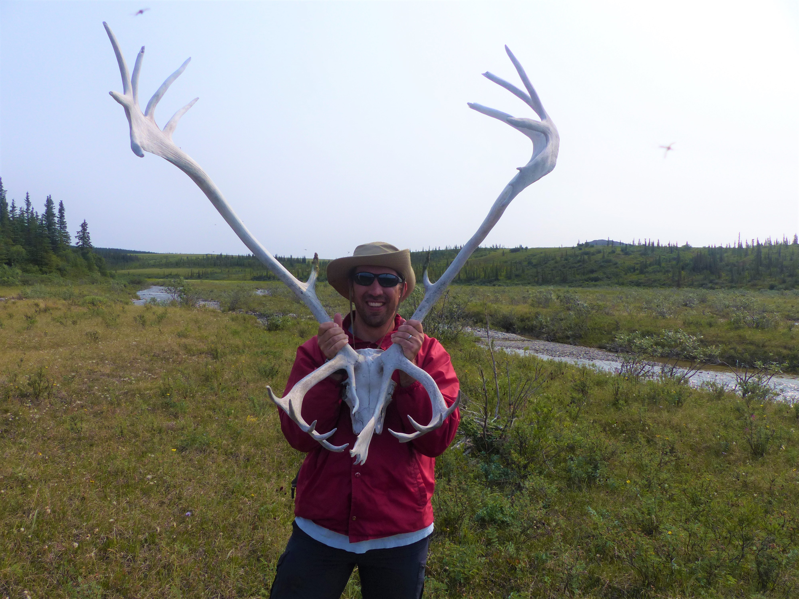

```{r setup, include=FALSE}
knitr::opts_chunk$set(echo = TRUE)
```

## Welcome to Tim Fullman's GitHub website

This is a test webpage used by Tim to try out content and practice web development skills. Development is ongoing.

Tim Fullman is a wildlife ecologist who studies movement and distribution of large herbivores. As a Senior Ecologist with <a href = "https://www.wilderness.org/" target = "_blank">The Wilderness Society</a> in Anchorage, Alaska, his research investigates caribou responses to energy development and other human activity.



Prior to that, he explored elephant movement patterns and impacts on vegetation and large herbivores in southern Africa while in graduate school at the University of Florida.


In all his work, Tim strives to develop scientific information that can be applied to positively influence decision making for conservation and management. Another passion is seeking to build bridges between science and faith communities based on shared values. When he is not working, Tim enjoys hiking, bicycling and wildlife photography, as well as visiting zoos with his wife and two children.

<br>

Last updated: 2021-12-06
